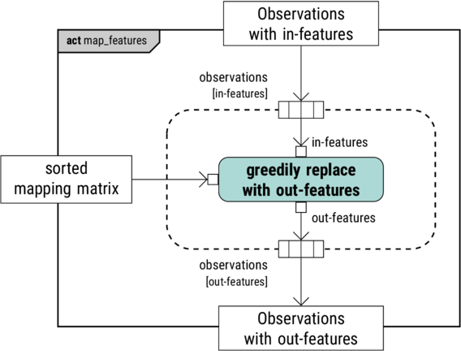
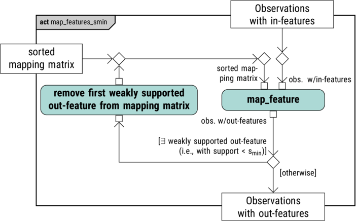

# Synopsis

Python module (using Rust) to transform a binary observation-feature1
matrix into a binary observation-feature2 matrix.

This is done by greedily applying a binary feature2-feature1 matrix
from top to bottom.

# Algorithm

Inputs:

* an OxM binary input feature matrix.
  row = obseration, column = input feature.

* an NxM binary "translation" or "mapping" matrix;
  row = output feature.  column = input feature.
  
Output:

* an OxN binary output feature matrix;
  row = output feature.  column = output feature.

There are two procedures made available:

    from feature_mapper import map_feature, map_feature_smin

The translation/mapping is performed, as follows (both variants).
Here the activity diagrams:

The variant `map_feature_smin` ensures, that all output features have
at least `smin` observations.

All matrices are internally processed as scipy.sparse.csr_matrix.

# Install

First, you need to install Rust, e.g. using `wget`:

    wget -O - https://sh.rustup.rs | sh -s
    
or see https://rustup.rs/

## via pip

    pip install feature-mapper

## via poetry

    poetry add feature-mapper

## via repo-clone (using pyenv)

    git clone https://github.com/complexity-science-hub/feature-mapper.git
    cd feature-mapper
    
A fresh installation of Python can (and probably should) be obtained via

* installing `pyenv`: https://github.com/pyenv/pyenv

Then (using `fish`):

    pyenv install (cat .python-version)
    pip install -U pip
    pip install maturin
    pip install tox

Build and run tests (takes a few minutes):

    tox
    
If all is well, install:

    pip install . -v

## License

https://www.gnu.org/licenses/gpl-3.0.html
